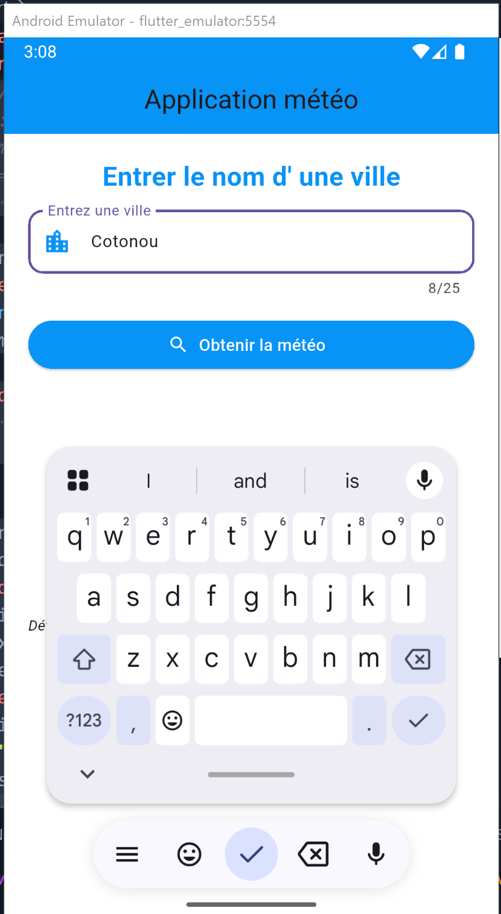
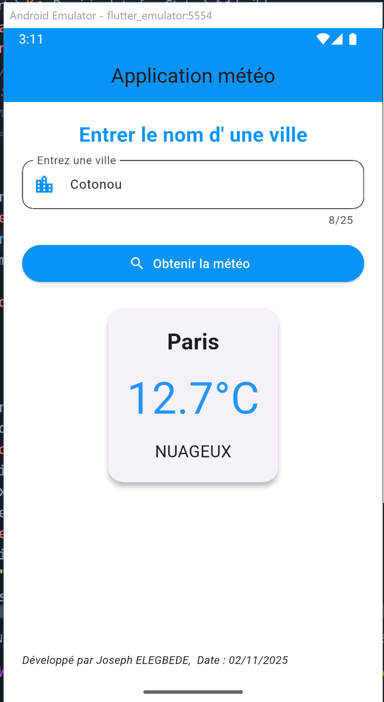
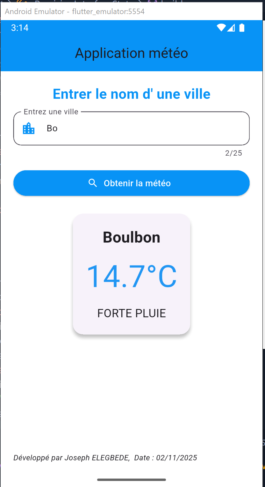
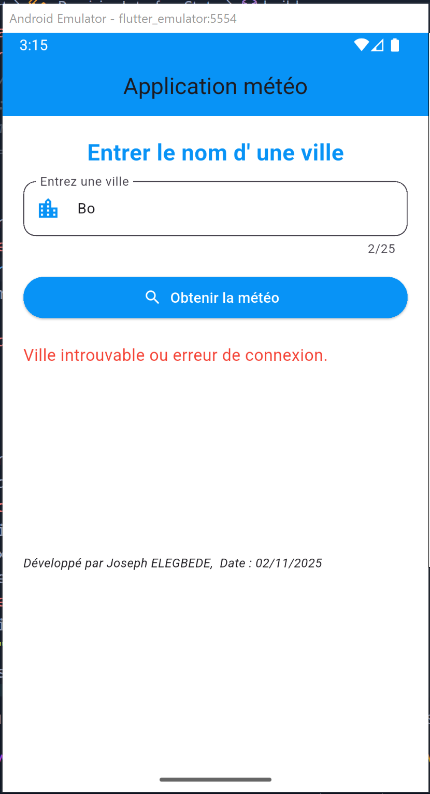
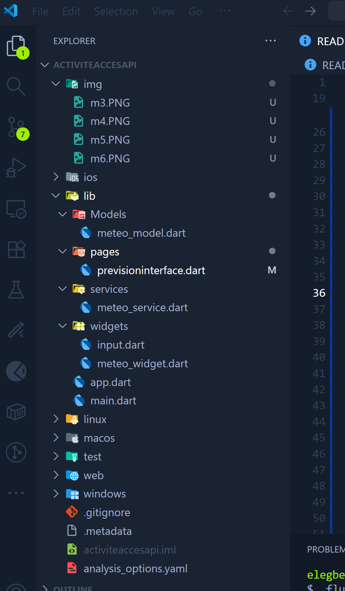

# gMeteoConnect - 🌤 Activité Accès API Météo - Flutter

## Auteur
**Joseph ELEGBEDE**  
Date : 02/11/2025 

## Description du projet

Cette application Flutter permet aux utilisateurs de **consulter les prévisions météorologiques actuelles** pour n’importe quelle ville dans le monde grâce à l’API OpenWeather.  

L’utilisateur entre le nom d’une ville, appuie sur le bouton “Obtenir la météo”, et l’application récupère les données en temps réel via l’API. Les informations principales affichées sont :  

- Nom de la ville  
- Température actuelle  
- Description météo (ex. “nuageux”, “ensoleillé”)  

L’application est conçue de manière **propre et modulaire**, avec des dossiers pour les modèles, services, widgets et pages.
---
## Fonctionnalités

- Saisie du nom de la ville via un champ texte (`TextField`)  
- Récupération des données météo via **OpenWeather API**  
- Affichage des données dans un `Card` Flutter  
- Gestion des erreurs si la ville est introuvable ou si la connexion échoue  
- Indicateur de chargement (`CircularProgressIndicator`) bleu pendant la récupération des données  
---
# Aperçu 


<p align="center">
  
  
  
  
  
  

</p>

> *Aperçu rapide de la structure du code.**

lib/
│
├── Models/
│ └── meteo_model.dart # Classe MeteoModel pour stocker les données météo
│
├── Services/
│ └── meteo_service.dart # Classe MeteoService pour interagir avec l'API OpenWeather
│
├── Widgets/
│ ├── input.dart # Widget réutilisable pour les champs de texte
│ └── meteo_widget.dart # Widget pour afficher la météo dans un Card
│
├── Pages/
│ └── prevision_interface.dart # Interface principale avec champ texte, bouton et affichage météo
│
└── app.dart # Point d’entrée de l’application Flutter

 


##  Objectifs pédagogiques

Ce projet vise à:
-Expliquer le fonctionnement du protocole HTTP (Hypertext Transfer Protocol) et son rôle dans les communications web.
-Identifier les principaux types de requêtes HTTP, comme GET, POST, PUT, DELETE, et leurs utilisations.
-Définir ce qu'est une API RESTful (Representational State Transfer) et comprendre ses principes fondamentaux.
-Comprendre les avantages de l'architecture REST pour la communication entre clients et serveurs.
-Intégrer des API RESTful dans des projets Flutter en utilisant le package http pour effectuer des requêtes HTTP.
-Manipuler les réponses JSON reçues des API pour extraire des données et les utiliser dans l'application.
-Créer un exemple pratique d'intégration d'une API RESTful dans une application Flutter, et mettre en œuvre des requêtes HTTP pour récupérer des données en temps réel à partir de l'API et les afficher dans l'application.


---

### 🛠️ Technologies utilisées

| Catégorie                 | Technologie                     |
| ------------------------- | ------------------------------- |
| **Framework mobile**      | Flutter                         |
| **Langage**               | Dart                            |
| **API externe**           | OpenWeatherMap API              |
| **Architecture**          | MVC (Model - View - Controller) |
| **Interface utilisateur** | Material Design                 |
| **Gestion d’état**        | setState (intégré à Flutter)    |
| **IDE recommandé**        | Android Studio / VS Code        |
| **Gestion de versions**   | Git & GitHub                    |
| **Outils de test/debug**  | Flutter DevTools                |


---
### 1️⃣ Prérequis

| Outil / Composant                 | Description / Version minimale recommandée                                     |
| --------------------------------- | ------------------------------------------------------------------------------ |
| **Flutter SDK**                   | ≥ 3.0.0                                                                        |
| **Dart SDK**                      | ≥ 3.0.0                                                                        |
| **Android Studio** ou **VS Code** | Environnement de développement intégré (IDE)                                   |
| **Android SDK**                   | Pour exécuter l’application sur un émulateur Android                           |
| **Git**                           | Pour le contrôle de version et le clonage du projet                            |
| **Connexion Internet**            | Requise pour récupérer les données météo via API                               |
| **Clé API OpenWeatherMap**        | À générer sur [https://openweathermap.org/api](https://openweathermap.org/api) |


--- 
dependencies:
| Dépendance                | Version recommandée | Description                                                                     |
| ------------------------- | ------------------- | ------------------------------------------------------------------------------- |
| **flutter**               | SDK stable          | Framework principal pour le développement multiplateforme (Android & iOS).      |
| **http**                  | ^1.5.0              | Permet d’effectuer des requêtes HTTP pour interagir avec l’API OpenWeatherMap.  |
| **flutter/material.dart** | SDK stable          | Fournit les composants Material Design pour construire l’interface utilisateur. |
| **dart:convert**          | SDK stable          | Pour encoder/décoder les données JSON récupérées depuis l’API.                  |


  📸 Illustration du flux utilisateur

Voici une représentation simplifiée du **flux de navigation** dans l’application :

```

+------------------------+
|  Page d'accueil        |
|  "Application météo"    |
+------------------------+
           |
           v
+------------------------+
|  Champ texte : ville   |
|  Bouton : Obtenir météo|
+------------------------+
           |
           v
+------------------------+
|  Requête API OpenWeather|
|  via MeteoService      |
+------------------------+
           |
           v
+------------------------+
|  Chargement affiché    |
|  (CircularProgress)    |
+------------------------+
           |
           v
+------------------------+
|  Données météo reçues  |
|  affichées via Card    |
|  (MeteoWidget)         |
+------------------------+
           |
           v
+------------------------+
|  Message d'erreur si   |
|  ville introuvable ou  |
|  problème réseau       |
+------------------------+

L’utilisateur entre le nom d’une ville.

Il appuie sur Obtenir météo, ce qui déclenche la requête à l’API.

Pendant la récupération, un CircularProgressIndicator bleu est affiché.

Une fois les données reçues, elles sont affichées dans un Card via MeteoWidget.

Si une erreur survient (ville introuvable ou problème réseau), un message d’erreur apparaît.

## ⚙️ Installation & Exécution

---

### 1️⃣ Cloner le dépôt

git clone https://github.com/elegbede01/gMeteoConnect/tree/master

voir la branche master

### 2️⃣ Se déplacer dans le projet 

# cd ton-repo 

### 3️⃣ Installer les dépendances

flutter pub get 

### 4️⃣ Lancer l’application

flutter run

 Auteur
Ir Joseph ELEGBEDE
💼 Développeur mobile et web  & analyste en Cybersécurité
📍 Bénin
🌐 LinkedIn: https://www.linkedin.com/in/joseph-elegbede-987998186/ 
 | GitHub: https://github.com/elegbede01 